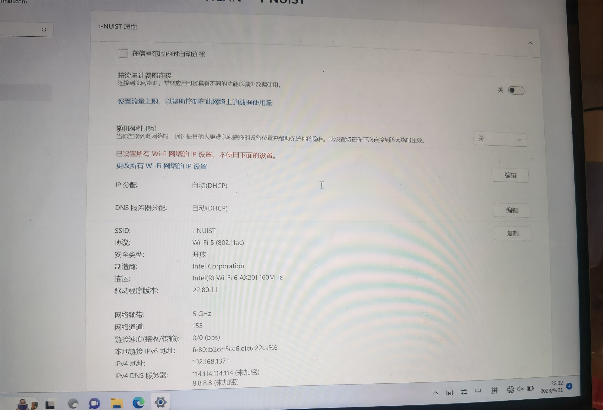
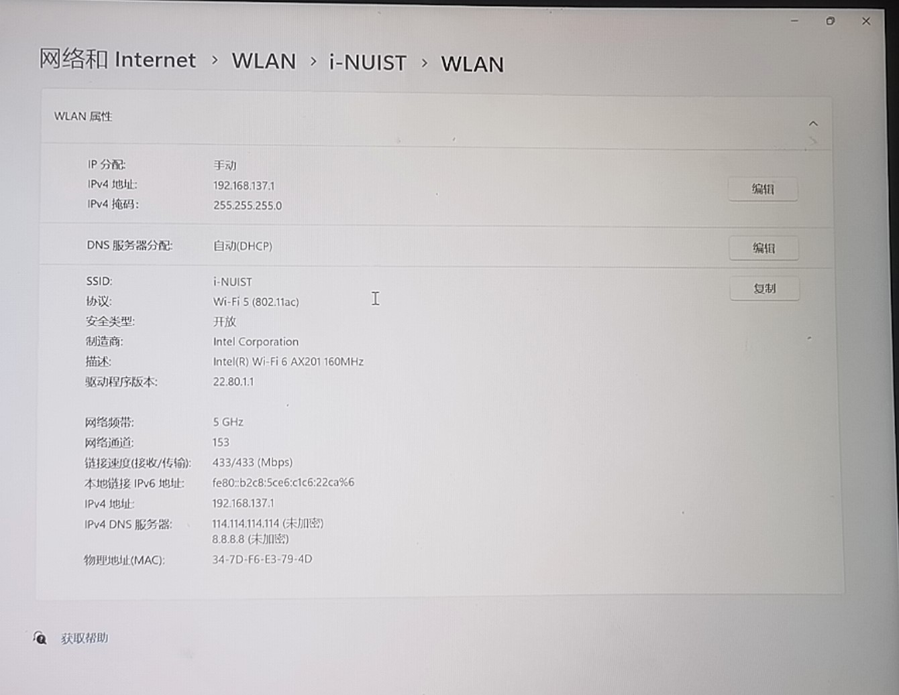
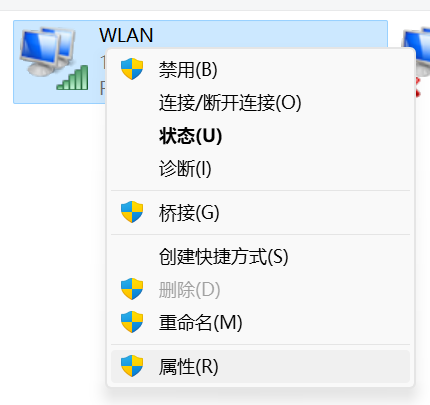
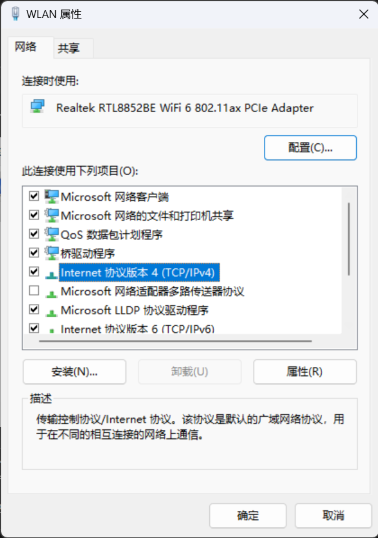
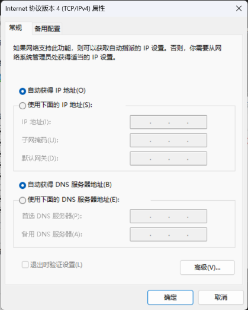
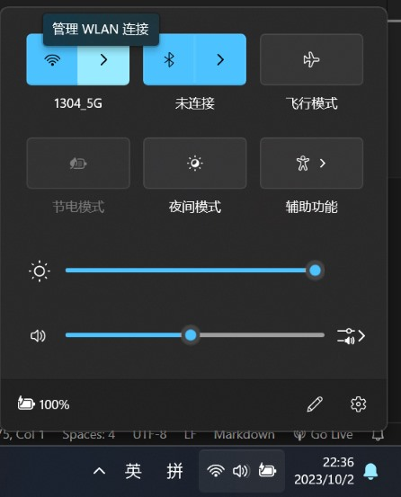
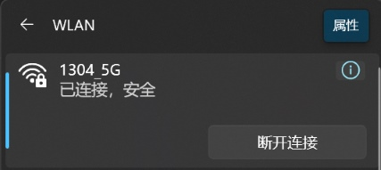
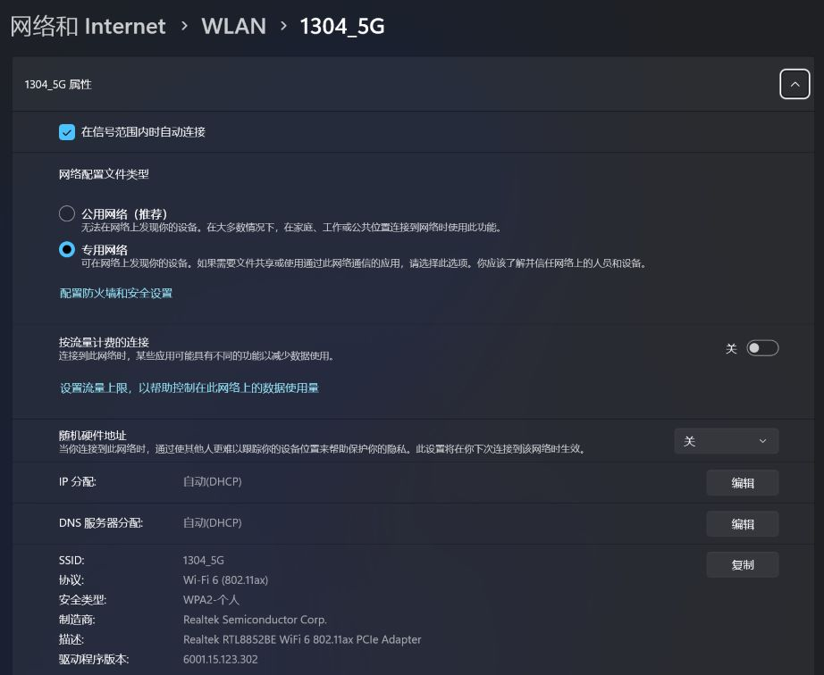
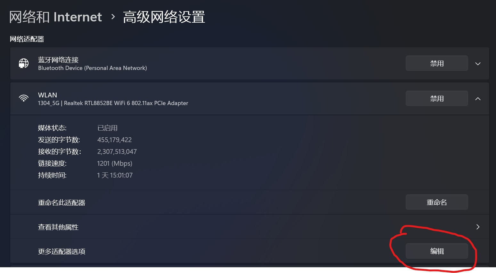

# 故障描述

据客户描述，她需要使用「华为共享」在华为笔记本与华为手机之间传输文件，而在关闭「华为共享」后，则出现了无法上网的情况。

且无论是「网络重置」，还是用手机「USB共享热点」，皆无法上网。

# 故障排查

## 网络重置

当得知「网络重置」这一招也无法奏效时，问题顿时变得棘手起来。因为「网络重置」是位于 `设置>网络和Internet>高级网络设置 >网络重置` 的一个选项。根据Windows设置的描述：

> 应用「网络重置」将删除所有网络适配器然后重新安装它们，并将其他网络组件设回为原始设置，你随后可能需要重新安装其他网络软件 VPN 客户端软件或虚拟交换机

按理说，重置能解决99%的问题，但这次是个例外，除了这次，还有一次也是例外。

## PE测试

为了排除物理网卡的硬件故障，我们选择进入一个带网卡驱动的PE系统。经过测试，PE系统中的网络一切正常，可正常上网，这说明不存在硬件故障。

## 重新检查网络设置

无奈之下，我们只能重新检查网络设置，结果有了意外发现，如下：

虽然 `IP设置` 和 `DNS设置` 都写的 `自动(DHCP)` ，但上面的那行红字清晰地告诉我们，不使用下面的设置，也就是说，它实际上并不是 `DHCP` 模式获取的，而是手动设置的。

之前没有发现这个，可能是因为太过于相信「网络重置」的力量，认为「重置」之后，IP与DNS设置应该也会被重置，且下面写的明明是 `自动(DHCP)` ，看的太快，而忽视了那行红字。两个原因综合起来，导致我们忽略了这个地方。

## 故障解决

点击"更改所有 WIFI 网路的 IP 设置"后，设置页面变成如下：

从中可以看到，`IP分配` 变成手动的了。我们将其改为自动，网络自然也就恢复了。

# 深入思考

其实，关于 `DNS` 与 `IP` 的设置，`win7` 与 `win10/11` 有一些区别。而我熟悉的是 `win7` 的那一套设置，也就导致这一次没有很快定位到问题所在。下面讲讲区别所在。

众所周知，`win7` 的系统设置是在「控制面板」中的，而 `win10/11` 加入了一个新的「设置」应用，同时也保留了传统的「控制面板」。

关于 `DNS` 与 `IP` 的设置，在「控制面板」与「设置」中，都能操作。我们可能认为这两个设置是同步的，操作的是同一个配置，但其实不是。

先分别讲讲「控制面板」与「设置」中的 `DNS` 与 `IP` 的设置吧。

## 「控制面板」

1. 首先打开「网络连接」设置页面。有很多途径进入这个页面，这里讲个最快的途径。先按Win+R打开「运行」，输入 `ncpa.cpl` ，按回车。
2. 右键「WLAN」，点击「属性」
    
3. 双击「Internet 协议版本 4（TCP/IPV4）」
    
4. 进入页面
    

## 「设置」

同样有很多种途径可以进入页面，这里讲最快的。

1. 点击这个`>`
    
2. 点击「属性」
    
3. 进入页面
    

注意到，「设置」里的页面为 `WLAN > 1304_5G`，这意味着这个页面的设置是对 `1304_5G` 这个wifi的单独设置。也就是对这个wifi的ip和dns进行手动设置，连接其他wifi并不是手动设置，不同wifi的设置是独立的。

而「控制面板」里的设置，是对 `WLAN` 这个适配器的设置，而所有wifi都是属于 `WLAN` 这个适配器的，这意味着在「控制面板」的设置，对所有wifi都生效。

那么谁的优先级高呢，自然是「控制面板」的优先级高。

- 若「控制面板」设置的是 `自动(DHCP)`，而「设置」里使用 `手动` ，则使用「设置」里的设置。

- 若「控制面板」设置的是 `手动` ，则「设置」里的设置不会生效。这时就会出现那行红字。

其实在「设置」里也有一个页面和「控制面板」的设置等效，那就是对适配器的设置，如下：

# 尾声

本文其实还留下一些疑点，比如为何「华为共享」关闭后没有恢复ip与dns设置，以及「网络重置」为何没有重置ip与dns设置。不过这些问题暂时还没有结果。

总之，关于网络的问题很多时候都是疑难杂症，只能用排除法一点点去找出问题根源所在。像前文提到的另一个例外，就是一个很特殊的情况，后面有机会再提吧。